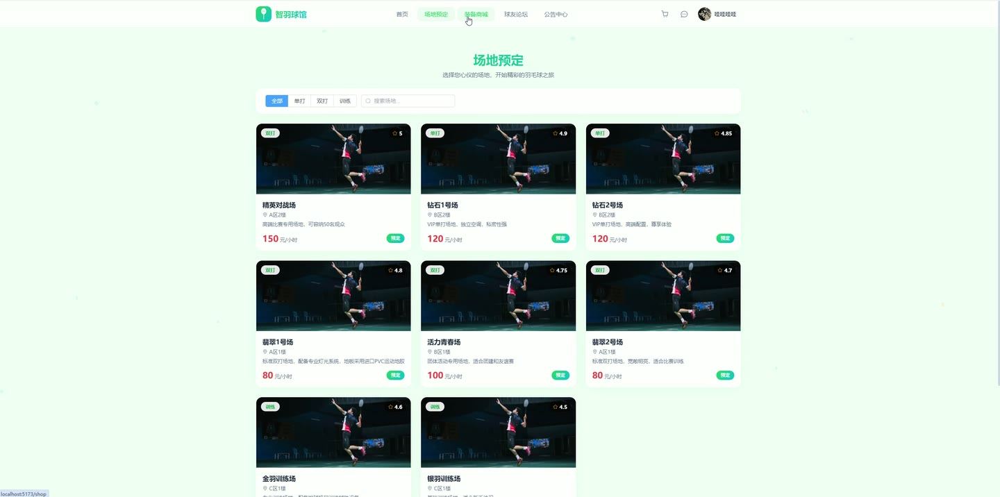
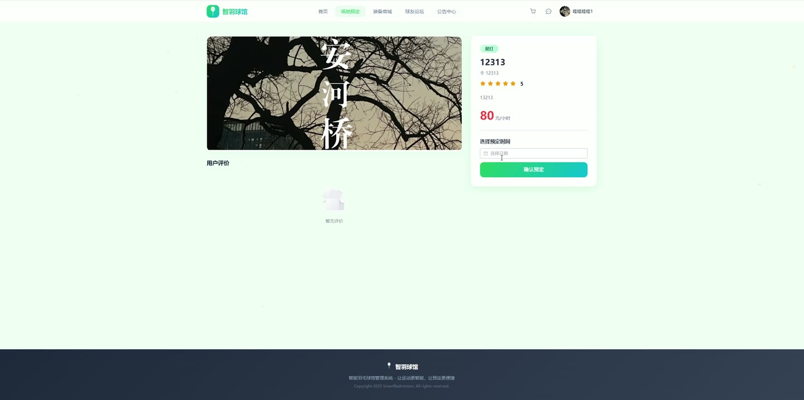
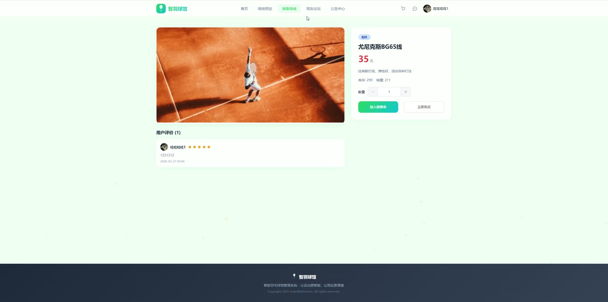

# (附文档)Springboot3+Vue3+MySQL 羽毛球馆管理系统

**技术栈**：Springboot3、Vue3、MySQL

### 系统简介

本系统是一套基于 Spring Boot 3 + Vue 3 前后端分离架构的羽毛球馆综合管理平台，涵盖用户端与管理员端两大角色。用户可在线浏览场地、预定时段、购买商品、参与论坛互动，管理员可对用户、场地、订单、公告、轮播图、论坛内容等进行全面管理，并内置客服消息、操作日志、充值记录等辅助模块。
 
### 核心功能
 
### 普通用户端

 
- 注册/登录账号，支持 JWT 身份认证，自动获取用户信息 
- 浏览场地列表（按类型、关键词筛选，按评分排序），查看场地详情与用户评价 
- 选择日期与时段进行场地预定，系统自动检测时段冲突并提示 
- 查看个人预定记录（按时间倒序），支持取消预定（状态为待审核或已支付时均可取消） 
- 在线支付预定费用（从余额扣款），支付后自动生成消费记录 
- 查看商品列表（按分类、关键词筛选，按销量排序），查看商品详情与商品评价 
- 将商品加入购物车，支持修改数量、删除单件或清空购物车 
- 从购物车提交订单，自动扣减库存并增加销量，支持取消未支付订单 
- 订单支付（余额扣款）、确认收货、对已完成订单发表商品评价（评分+内容） 
- 查看个人订单列表（含订单项、是否已评价状态） 
- 账户余额充值，充值满额赠送比例奖励（满 500 送 10%、满 1000 送 15%、满 2000 送 20%）并自动提升会员等级 
- 查看充值记录与消费记录（按时间倒序分页展示） 
- 编辑个人资料（昵称、手机、邮箱、头像），修改登录密码（需验证旧密码） 
- 浏览公告列表，查看弹窗公告 
- 发布论坛帖子（标题与内容自动过滤敏感词），查看帖子详情（自动增加浏览量） 
- 对帖子发表评论，对帖子点赞（点赞数 +1） 
- 查看场地推荐列表（基于协同过滤算法的相似用户推荐，未登录时按评分推荐） 
- 查看首页轮播图（仅展示启用状态的图片，按排序字段排列） 
- 发起客服聊天（自动分配给管理员），查看聊天记录，标记消息已读 
- 对已消费的场地发表评价（评分+内容），评价后自动更新场地平均评分
 
### 管理员端

 
- 用户管理：查看用户列表（支持用户名/昵称/手机模糊搜索），启用/禁用用户账号，编辑用户信息（昵称、手机、邮箱、会员等级、角色），重置用户密码为 123456 
- 场地管理：查看场地列表（按 ID 升序），新增场地（填写名称、描述、图片、价格、位置、类型等），编辑场地信息，删除场地 
- 预定审核：查看所有预定记录（按时间倒序，支持按状态筛选），审核通过预定（状态置为已通过），驳回预定（状态置为已驳回，若已支付则自动退款并恢复余额） 
- 商品管理：查看商品列表（按时间倒序），新增商品，编辑商品信息，删除商品 
- 订单管理：查看所有订单（按时间倒序，支持按状态筛选），手动修改订单状态 
- 公告管理：查看公告列表（按时间倒序），新增公告（支持普通公告与弹窗公告两种类型），编辑公告，删除公告 
- 论坛管理：查看帖子列表（按时间倒序），启用/禁用帖子，删除帖子（同时删除该帖所有评论） 
- 轮播图管理：查看轮播图列表（按排序字段升序），新增轮播图（标题、图片、链接、排序、状态），编辑轮播图，删除轮播图 
- 操作日志：查看系统操作日志（按时间倒序分页展示） 
- 充值管理：查看所有用户的充值记录（按时间倒序，显示充值前后余额） 
- 客服管理：查看与用户的历史聊天列表（显示未读消息数），查看与指定用户的聊天详情，回复用户消息
 
### 技术栈

 后端框架Spring Boot 3.x ORMMyBatis-Plus (BaseMapper + 分页插件) 权限认证JWT (jjwt) + 自定义拦截器 前端框架Vue 3 (Vite 构建) 状态管理Pinia 路由Vue Router (History 模式) UI 组件Element Plus 数据库MySQL 8.x 文件上传MultipartFile + 本地存储
 
### 交付内容

 
- 后端完整源码 
- 前端完整源码 
- 数据库初始化脚本 
- 万字文档

## 界面展示

---

## 获取完整源码 + 万字文档

本仓库为项目介绍页。**完整前后端源码、数据库初始化脚本、万字项目文档**，请加微信 `kangkangcode`，或访问 [codekk.top](http://codekk.top) 获取。

可作课程设计 / 毕业设计参考，支持远程部署调试。